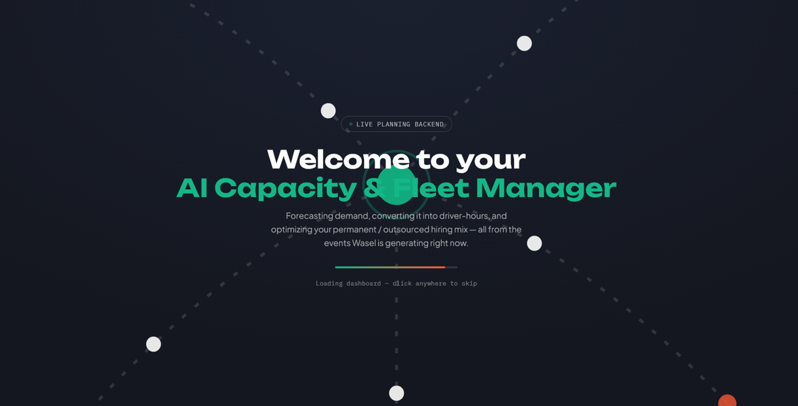
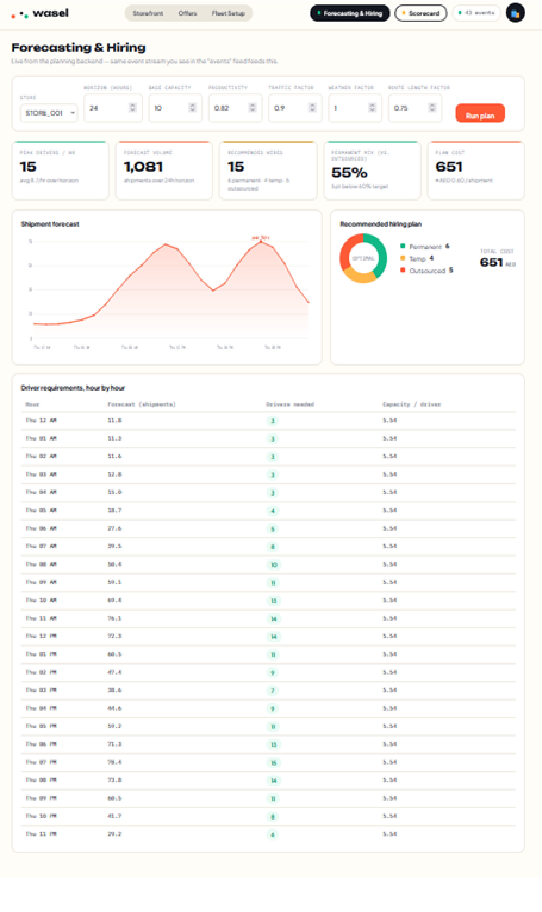

# AI Workforce Planning Engine

See docs/STATUS.md for what's built vs. still TODO per phase.

## Docker (recommended — one URL, frontend + backend + db)
    docker compose up --build
Then open **http://localhost:8000** — the built Wasel frontend is served
from the same origin as the API (`/v1/...`), so there's only one address
to visit. See `docs/TESTING_AND_INTEGRATION.md` §5 for details and §6.3
for how the frontend's events feed the forecasting engine.

## Run the backend locally (no Docker)
    pip install -r requirements.txt
    python scripts/generate_synthetic_data.py --stores 5 --days 120 --seed 42
    uvicorn apps.api.main:app --reload
Serves the API at http://127.0.0.1:8000. If `apps/web/dist` exists (see
below), it's served from `/` too — otherwise this is API-only.

## Test
    pytest

## Frontend dev (live-reload, separate port — for active UI development)
`apps/web` (Vite + React) can also run as its own dev server with hot
reload, on its own port, separate from the API:

    cd apps/web
    npm install
    npm run dev -- --port 5174

This is the mode to use while *editing* the frontend. For a demo or a
build you can hand someone a single link to, build it instead and let the
API serve it:

    cd apps/web && npm run build
    cd .. && uvicorn apps.api.main:app --reload
Then http://127.0.0.1:8000 serves both. `docker compose up --build` does
this automatically.

## images:

